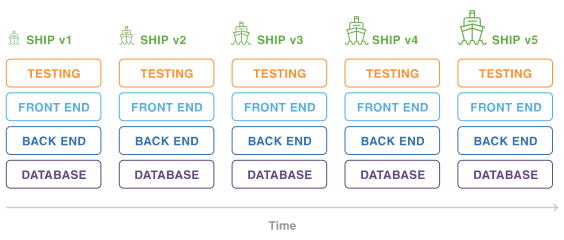

# Agile methodology

## Intro
In semester 3 we are tasked with learning about the agile methodology and how to implement these methods within our projects. This document will elaborate on what agile is and how I've implemented these methods within my projects within this semester.

## What is agile?
Agile is an iterative approach to project management and software development that helps teams deliver value to their customers faster and with fewer headaches. Instead of betting everything on a "big bang" launch, an agile team delivers work in small, but consumable, increments. Requirements, plans, and results are evaluated continuously so teams have a natural mechanism for responding to change quickly. 

Within the Agile manifesto, there are 4 values and 12 principles that guide the Agile philosophy:

**4 Values of Agile:**
1. Individuals and interactions over processes and tools.
2. Working software over comprehensive documentation.
3. Customer collaboration over contract negotiation.
4. Responding to change over following a plan.

**12 Principles of Agile:**

1. Our highest priority is to satisfy the customer through early and continuous delivery of valuable software. 
2. Welcome changing requirements, even late in development. Agile processes harness change for the customer's competitive advantage. 
3. Deliver working software frequently, from a couple of weeks to a couple of months, with a preference to the shorter timescale. 
4. Business people and developers must work together daily throughout the project. 
5. Build projects around motivated individuals. Give them the environment and support they need, and trust them to get the job done. 
6. The most efficient and effective method of conveying information to and within a development team is face-to-face conversation. 
7. Working software is the primary measure of progress. 
8. Agile processes promote sustainable development. The sponsors, developers, and users should be able to maintain a constant pace indefinitely. 
9. Continuous attention to technical excellence and good design enhances agility. 
10. Simplicity--the art of maximizing the amount of work not done--is essential. 
11. The best architectures, requirements, and designs emerge from self-organizing teams. 
12. At regular intervals, the team reflects on how to become more effective, then tunes and adjusts its behavior accordingly. 

## Agile vs Waterfall

Within the waterfall method, a project has a clearly defined sequence of execution with project phases that do not advance until it's given an approval. In contrast, the agile method takes an iterative approach with continuous releases and incorporates regular customor feedback.

Because of agile's iterative nature, it's easier to adapt to changing circumstances and to gather customer feedback compared to the strict waterfall model with a set schedule.

**Waterfall release process**

**Agile release process**

