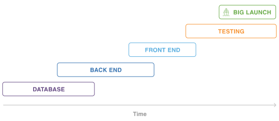
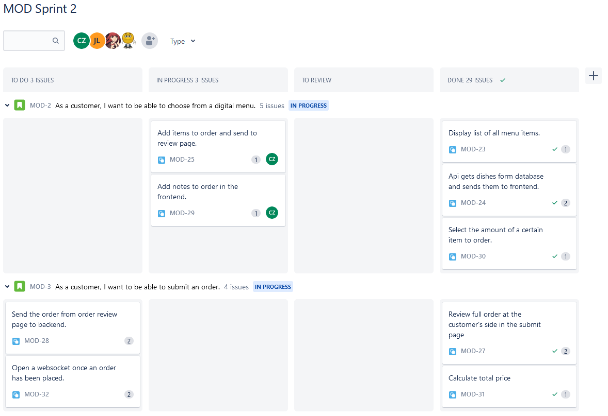

# Agile methodology

## Table of content
- [Intro](#intro)
- [What is agile?](#what-is-agile?)
- [Agile vs waterfall](#agile-vs-waterfall)
- [GP implementation](#gp-implementation)
  - [Structure](#structure)
    - [Daily](#daily)
    - [Sprint](#sprint)
  - [Tools](#tools)
    - [GitHub Projects (abandoned)](#github-projects-abandoned)
    - [Jira](#jira)
    - [SonarCloud](#sonarcloud)
    

## Intro
In semester 3 we are tasked with learning about the agile methodology and how to implement these methods within our projects. This document will elaborate on what agile is and how I've implemented these methods within my projects within this semester.

## What is agile?
Agile is an iterative approach to project management and software development that helps teams deliver value to their customers faster and with fewer headaches. Instead of betting everything on a "big bang" launch, an agile team delivers work in small, but consumable, increments. Requirements, plans, and results are evaluated continuously so teams have a natural mechanism for responding to change quickly. 
*Source: https://www.atlassian.com/agile*

Within the Agile manifesto, there are 4 values and 12 principles that guide the Agile philosophy:

**4 Values of Agile:**
1. Individuals and interactions over processes and tools.
2. Working software over comprehensive documentation.
3. Customer collaboration over contract negotiation.
4. Responding to change over following a plan.

**12 Principles of Agile:**

1. Our highest priority is to satisfy the customer through early and continuous delivery of valuable software. 
2. Welcome changing requirements, even late in development. Agile processes harness change for the customer's competitive advantage. 
3. Deliver working software frequently, from a couple of weeks to a couple of months, with a preference to the shorter timescale. 
4. Business people and developers must work together daily throughout the project. 
5. Build projects around motivated individuals. Give them the environment and support they need, and trust them to get the job done. 
6. The most efficient and effective method of conveying information to and within a development team is face-to-face conversation. 
7. Working software is the primary measure of progress. 
8. Agile processes promote sustainable development. The sponsors, developers, and users should be able to maintain a constant pace indefinitely. 
9. Continuous attention to technical excellence and good design enhances agility. 
10. Simplicity--the art of maximizing the amount of work not done--is essential. 
11. The best architectures, requirements, and designs emerge from self-organizing teams. 
12. At regular intervals, the team reflects on how to become more effective, then tunes and adjusts its behavior accordingly. 
*Source: https://agilemanifesto.org*

## Agile vs Waterfall

Within the waterfall method, a project has a clearly defined sequence of execution with project phases that do not advance until it's given an approval. In contrast, the agile method takes an iterative approach with continuous releases and incorporates regular customor feedback.

Because of agile's iterative nature, it's easier to adapt to changing circumstances and to gather customer feedback compared to the strict waterfall model with a set schedule.

**Waterfall release process**

**Agile release process**

*Source: https://www.atlassian.com/agile/project-management/project-management-intro*

## GP implementation

The repo for our group project can be found [here](https://github.com/Modus-1).

### Structure
#### Daily

Each day we start with a stand-up lead by the scrum master, where we discuss our current standing in our project and devide open backlog items to the group memebers when possible. At the end of the day we discuss the progress we have made in the day and what subjects we will take to the next day.

#### Sprint
Before the start of each sprint, we set up new user stories based on the project description, assign points to the user stories with scrum poker and define the acceptance criteria for each of them. We then discuss this with our product owner, where we set the priorities and the goals for the next sprint. The tasks needed to be done gets assigned to every team member during our daily stand-up. Before the end of a sprint, we give our product owners a heads-up of our progress for expectation management and prepare a presentation for the sprint review. 

### Tools
#### GitHub Projects (abandoned)
We decided to use GitHub Projects as our scrum board in the beginning of our GP. We had two different boards, with one for user stories and one for tasks and issues, as this was recommended to us by our IP teacher to keep them seperated. On 15 september 2022, switched over to Jira as our scrum board, as GitHub Projects lacked features that Jira does have, like issue types, child issues, assigning points and burndown charts.

#### Jira
As of 15 september 2022, we're using Jira as our scrum board and re-organised to have the user stories and tasks in a single board. This was advised to us by our GP teacher, as this gives a better overview of all the issues within a sprint for both us as a team and the product owners. As this seemed more logical to us as a team, we decided to switch to the structure of one scrum board with both user stories and tasks.

 
*Snippet of our Jira scrum board as of *21 october 2022*

#### SonarCloud
We are using SonarCloud to check for code quality within our GP. During each push to our repository, SonarCloud will check the code for things like code smells. test coverage, unnecessary code, code coverage, etc. Only if all of these checks pass, are we able to merge branches into our main or develop branches. 

We currently have set our code coverage goal at 80%, but from feedback from our IP teacher about only needing to test code that are relevant to our user stories, we've decided to discuss this matter once more in the future.
