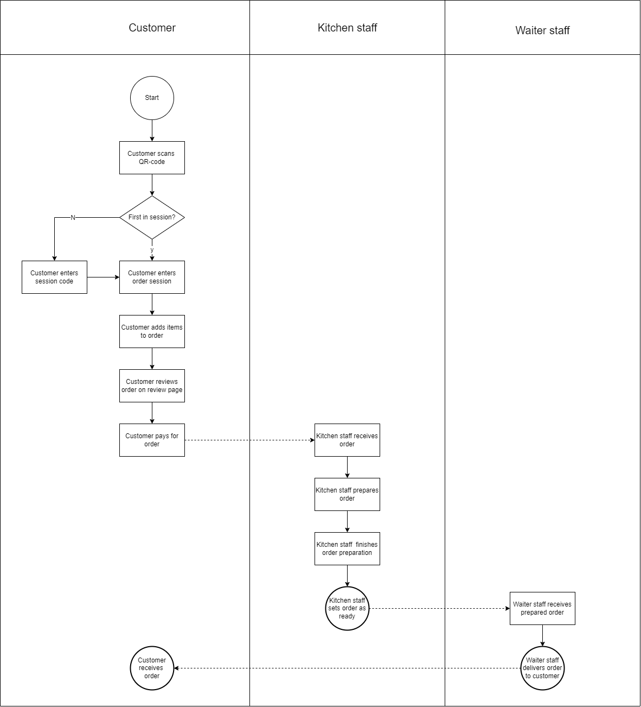

# Business processes

## Business process within our group project
Our group project for this semester is to make a Digital Menu Application. The project description was given to us by our product owner, which can be found [here](../design&analysis/digital-menu-application-project-description). To describe the business process within the application, a Business Process Modeling Notation (BPMN) can be used to display the flow of the process. The BPMN of our application can be seen down below.
