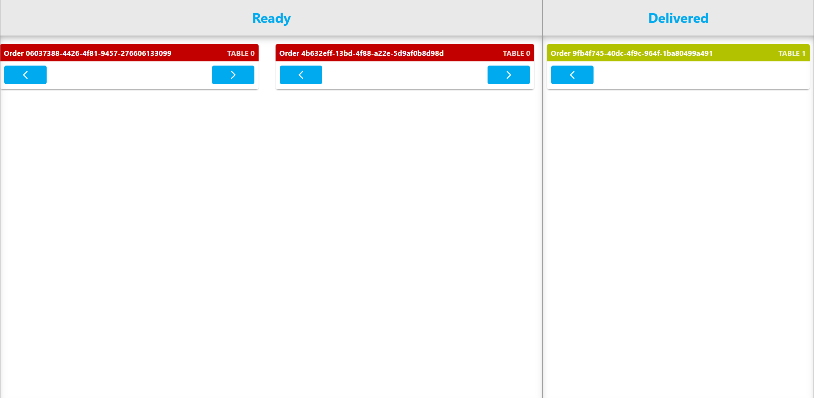

# Business processes

## Table of content
- [Business process within our group project](#business-process-within-our-group-project)
- [Customer process](#customer-process)
- [Kitchen staff process](#kitchen-staff-process)
- [Waiter staff process](#waiter-staff-process)

## Business process within our group project
Our group project for this semester is to make a Digital Menu Application. The project description was given to us by our product owner, which can be found [here](../design&analysis/digital-menu-application-project-description.md). To describe the business process within the application, a Business Process Modeling Notation (BPMN) can be used to display the flow of the process. The BPMN of our application can be seen down below.

## Customer process
When a customer enters the restaurant, they will take a seat on one of the available tables. Once seated, they can scan a QR code, which can be found on the table. If the customer is the first person to scan the code, they will be immediately redirected to the menu page. If not, then they will be redirected to the landing page, where they will have to ask the first person of the session for the code to enter.

*Landing page*

*Menu page*

On the menu page, the customers can add items to their order. When they have selected all the items they want to order, they can go to the order review page to review their order, make changes to the order and add an optional note. Once everything is checked, they can place the order and pay the fees. After the staff has processed the order, they will receive the items they have ordered and will be able to enjoy their meal.

*Review page*

## Kitchen staff process
When customers place their order, it will be sent to the staff page for them to process the orders. The kitchen staff will receive the orders as `new` orders in order of the time they got added. The kitchen staff can change the status of the orders they are working on. When an order is set to `ready`, it will be sent to the waiter side of the staff page. Should they accidentally set the status of the wrong order, they can always return them to the correct one.

*Staff kitchen page*

## Waiter staff process
When the kitchen staff sets the order to `ready`, it will become visible on their page. After they have sent the order to the corresponding table, they can set the order to done, where it will stay till the end of the day.

*Staff waiter page*