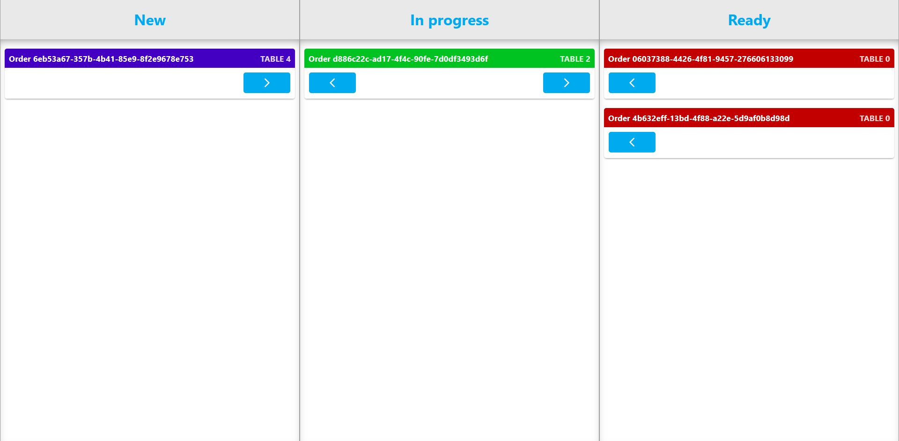

# Requirements and design (GP)

## Table of content
- [Project analysis](#project-analysis)
- [Architectural designs](#architectural-designs)
- [UI](#ui)

## Project analysis
At the start of the project, we had a meeting with our product owners where we discussed the available projects we could work on during this semester. Each project was divided into milestones in which we could work our way to a finished project. Our group chose the Digital Menu Application as our project, of which you can find the project description [here](../design&analysis/digital-menu-application-project-description.md).

Our group works with the [Agile methodology](./agile-methodology.md). Each sprint we define/refine user stories, use planning poker to define the load, regularly hold meetings with our stakeholders, and hold retrospectives with the group at the end of each sprint.

## Architectural designs
For the architectural design of the application, we've used draw.io. The design was made as a group and discussed with our product owners As we're using the Agile methodology, some changes within the architecture did happen, like the removal of the manager API. We removed this API from our project, as this API would share a lot of similar code as the menu API, so we've merged them together and have both the customer and manager frontend make requests to the menu API.

Another change was the addition of a gateway, as the lack thereof would allow a user to change the requests and send them to the APIs, like changing the total price of an order to €0. With a gateway, each request will be checked for its validity before it gets sent to the APIs.

A snippet of the designs are shown down below.

*Context diagram*

*Container diagram (current)*

*Container diagram (old)*

## UI
The customer frontend designs are made as a group figma. Like with the architectural designs, these are discussed and approved by our product owners. 

### Customer frontend
As inspiration for the design of the customer frontend, we've looked into existing solutions to get a better understanding of a good UX for an application like ours (like Thuisbezorgd en Uber Eats). The UI for the customer frontend is designed with the focus on making it attractive to the customer. Down below are snippets of our designs.

*Design landing page*

*Design menu page*

*Design review page*

### Staff frontend
For the staff frontend we've taken a different approachon designing the UI. Unlike the customer frontend, the staff frontend doesn't need to look fancy, but it needs to be functional and easy to use in the a restaurant environment. To achieve that, we've tried to design the UI as simple as possible while keeping it functional with big interactive buttons to make it easy to use for the kitchen staff. While we had ideas for a drag and drop design, it was decided not to use it, as it would be unhygienic on the kitchen side to have to touch the screen more than necessary. To keep the staff pages the uniform, it's decided to keep the waiter's side of the frontend similar to the kitchen's side. Down below are snippets of the staff frontend.

*Design staff landing page*

*Design staff kitchen page*

*Design staff waiter page*