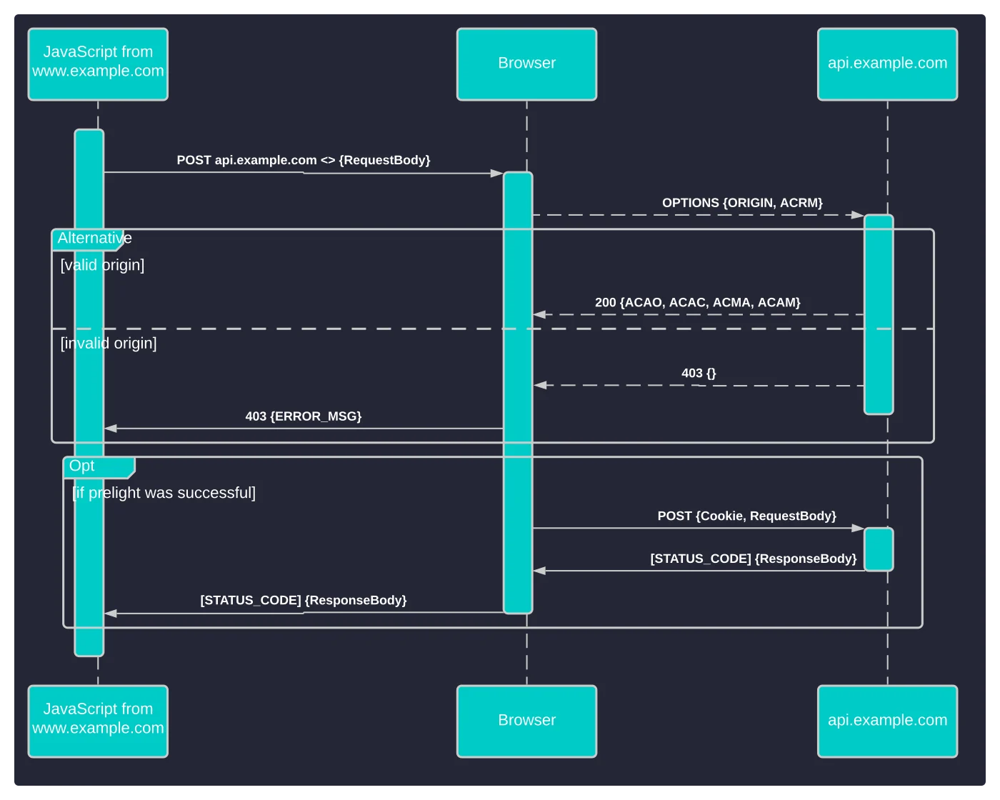
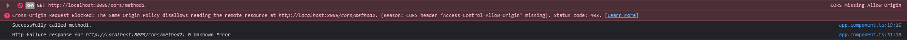
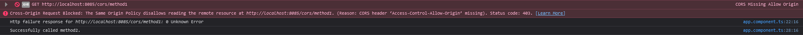

# How to implement CORS in the Shazzboard project?

## Table of content
- [Intro](#intro)
- [What is CORS?](#what-is-cors?)
- [How do resource requests work?](#how-do-resource-requests-work?)
- [How does CORS work?](#how-does-cors-work?)
- [What are the dangers surrounding CORS?](#what-are-the-dangers-surrounding-cors?)
- [How do I use CORS in my APIs?](#how-do-i-use-cors-in-my-apis?)
	- [Spring Boot](#spring-boot)
	- [CORS in controller](#cors-in-controller)
	- [CORS globally](#cors-globally)
- [Conclusion](#conclusion)
- [References](#references)
- 

## Intro
In semester 3 we're tasked with developing a web application. To keep the project loosely coupled and scalable, the project is made with the microservices architecture in mind. Due to this, each service will send a request from their own origin, which causes cross origin requests to happen. As an application should only allow access to specific services, this research will focus on how to implement CORS within the Shazzboard project.

## What is CORS?
CORS (Cross-Origin Resource Sharing) is a mechanism that allows access to resources within a service to be accessed from a permitted origin and relies on a mechanism by which browsers make  a "preflight" request using the HTTP method OPTIONS to the service hosting the CORS.<sup>[[1]](#cors-mozilla)</sup>

While CORS adds functionality to SOP (Same-Origin Protocol), it also allows for potential cross-domain attacks if the CORS policy isn't set up properly. CORS also doesn't protect a service from cross-origin attacks like CSRF (Cross-Site Request Forgery).<sup>[[2]](#cors-protswigger)</sup>

## How do resource requests work?
Services can exchange data via network with HTTP (Hypertext Transfer Protocol), which defines the communication rules between the requester and the responder. Both the request and response messages are devided into a header and body.

The header contains the information regarding type of message or the encoding of the message. This information is stored as key-value pairs. The body contains the message itself in JSON, HTML, etc.<sup>[[3]](#cors-web-dev)</sup>

## How does CORS work?
The CORS workflow starts when a script one origin makes a request to another origin. `Origin A` will send a preflight request via HTTP to `Origin B`. `Origin B` then validates the preflight requests headers  if it is allowed to make the actual request. If the verification succeeds, then `Origin B` will respond with its own set of HTTP headers, which defines the range of acceptable origins, request methods, custom headers, if it's acceptable to send credentials and how long `origin A` should keep the response.<sup>[[4]](#cors-stackhawk)</sup>

*Workflow of a CORS requests*<sup>[[4]](#cors-stackhawk)</sup>

## What are the dangers surrounding CORS?
While enabling CORS on a service is better than not using it, there are still problems that could arise when you don't set it up correctly, which can lead to cross-origin attacks like mentioned before. A few commonly occuring vulnerablilities when setting up CORS are as follows:
- Using the asterisk (\*) value in the `Access-Control-Allow-Origin` header. This causes the CORS to allow any origin to access the service.
- Using the "null" value in the `Access-Control-Allow-Origin` header, thinking it will disable CORS. This will have the same effect as using the asterisk.
- Setting up a dynamic `Access-Control-Allow-Origin` with improper server-side validation. If set up improperly within a domain, this can lead to opening backdoors to unwanted visitors and requests.<sup>[[5]](#cors-vuln-tenable)</sup>

## How to use CORS in APIs?
As of writing this research, the Shazzboard project only uses the Spring Boot framework as a service with endpoints. Therefore, this research will only focus on for to enable CORS in Sring Boot. Should more frameworks be used in the future, then those will be added.

### Spring Boot
To start, go to https://start.spring.io/ to create a Spring Boot application. Before you generate a project, add the `Spring Web` dependency to your project. In case of a Maven project, select `Maven` under `Project` and generate the project. Alternatively, you can manually add the depedency by going to the `pom.xml` file in the project and under `<dependencies>` change the following lines:
```xml
<dependency>
	<groupId>org.springframework.boot</groupId>
	<artifactId>spring-boot-starter</artifactId>
</dependency>
```

to this:
```xml
<dependency>
	<groupId>org.springframework.boot</groupId>
	<artifactId>spring-boot-starter-web</artifactId>
</dependency>
```

To implement CORS into the Spring Boot Maven project, it will need the Apache `httpClient` library. Add the following lines in the `pom.xml` under `<dependencies>`:
```xml
<dependency>
  <groupId>org.apache.httpcomponents</groupId>
  <artifactId>httpclient</artifactId>
  <scope>test</scope>
</dependency>
```


In case of a Gradle project, select `Gradle` under `Project`. To manually add the `Spring Web` dependency in a Gradle project, go to the `build.gradle` file and under `dependendies` change the following line:
```
implementation 'org.springframework.boot:spring-boot-starter'
```

to this:
```
implementation 'org.springframework.boot:spring-boot-starter-web'
```
To implement CORS into the Spring Boot Gradle project, it will need the Apache `httpClient` like with the Maven project. Add the following line in the `build.gradle` under `dependencies`:
```
testImplementation 'org.apache.httpcomponents:httpclient'
```

With the dependencies set, we can now enable CORS. This can be enabled either in the controllers, globally for the entire project, or a mix of both.

#### CORS in controller
To enable CORS from within the controller, you will have to add the `@CrossOrigin` annotation above a mapping. This way, you will only expose the specific mapping to the given origin. The `@CrossOrigin` mapping allows the following attributes:
- origins
- methods
- allowedHeaders
- exposedHeaders
- allowedCredentials
- maxAge

#### CORS globally
To enable CORS globally in the application, you will have to add the the following in the application class of the project:
```java
public WebMvcConfigurer corsConfigurer() {
	return new WebMvcConfigurer() {
		@Override
		public void addCorsMappings(CorsRegistry registry) {
			//Your mappings
		}
	};
}
```
Within the `addCorsMappings` method, you can add all the mappings for the CORS.<sup>[[6]](#cors-spring-web)</sup>

## Conclusion
To test if the above findings are correct, a [Spring Boot application](https://github.com/rmzhen/PoC_CORS-Spring-Boot) on port `8085` and an [Angular application](https://github.com/rmzhen/PoC_CORS-Angular) on port `4200` have been created as a proof of concept. The Angular application has 2 methods that make a call to the Spring boot application:
```js
public callMethod1() {
	return this.http.get('http://localhost:8085/cors/method1', {
		responseType: 'text',
    });
}

  

public callMethod2() {
	return this.http.get('http://localhost:8085/cors/method2', {
		responseType: 'text',
	});
}
```

These 2 methods in the Spring Boot application are attempted to be called:
```java
@GetMapping("/method1")  
public ResponseEntity<String> testMethod1() {  
    String message = "Successfully called method1.";  
    return new ResponseEntity<String>(message, HttpStatus.OK);  
}  
  
@GetMapping("/method2")  
public ResponseEntity<String> testMethod2() {  
    String message = "Successfully called method2.";  
    return new ResponseEntity<>(message, HttpStatus.OK);  
}
```

For the first setup, CORS has been enabled within the controller like this:
```java
@CrossOrigin(origins = "http://localhost:4200")  
@GetMapping("/method1")  
public ResponseEntity<String> testMethod1() {  
    String message = "Successfully called method1.";  
    return new ResponseEntity<String>(message, HttpStatus.OK);  
}  
  
@CrossOrigin(origins = "http://localhost:4201")  
@GetMapping("/method2")  
public ResponseEntity<String> testMethod2() {  
    String message = "Successfully called method2.";  
    return new ResponseEntity<>(message, HttpStatus.OK);  
}
```
With this setup, the Angular application should be able to call the first method, but not the second method, as the allowed origin within the second method doesn't match that of the Angular application. When running the Angular application, the console shows the following:

As visible in the snippet, the first method was successfully called, while the second method's request got blocked by the CORS settings.

For the second setup, CORS has been enabled globally within the application like this: 
```java
@Bean  
public WebMvcConfigurer corsConfigurer() {  
   return new WebMvcConfigurer() {  
      @Override  
      public void addCorsMappings(CorsRegistry registry) {  
         registry.addMapping("/cors/method1").allowedOrigins("http://localhost:4201");  
         registry.addMapping("/cors/method2").allowedOrigins("http://localhost:4200");  
      }  
   };  
}
```
With this setup, the Angular application should be able to call the second method, but not the first method. When running the Angular application, the console shows the following:

As visible in the snippet, the second method was successfully called, while the first method's request got blocked by the CORS setting.

With the proof of concept made above, the conclusion can be made that CORS can be enabled within the Shazzboard project with the above mentioned methods within Spring Boot.

## References
> [1] <a name="cors-mozilla"/> _Cross-Origin Resource Sharing (CORS) - HTTP | MDN_. (2022b, December 5). https://developer.mozilla.org/en-US/docs/Web/HTTP/CORS

> [2] <a name="cors-portswigger"/> _What is CORS (cross-origin resource sharing)? Tutorial & Examples | Web Security Academy_. (n.d.). https://portswigger.net/web-security/cors

> [3] <a name="cors-web-dev"/> _Cross-Origin Resource Sharing (CORS)_. (n.d.). web.dev. https://web.dev/cross-origin-resource-sharing/

> [4] <a name="cors-stackhawk"/> _What is CORS?_ (n.d.). StackHawk. https://www.stackhawk.com/blog/what-is-cors/

> [5] <a name="cors-vuln-tenable"/> _Understanding Cross-Origin Resource Sharing Vulnerabilities_. (2020, September 11). Tenable®. https://www.tenable.com/blog/understanding-cross-origin-resource-sharing-vulnerabilities

> [6] <a name="cors-spring-web"/> _Enabling Cross Origin Requests for a RESTful Web Service_. (n.d.). Spring. https://spring.io/guides/gs/rest-service-cors/

## DOT Framework matrix
| Research part | Library | Field | Lab | Showroom | Workshop |
|:------------|:---|:---|:---|:---|:---:|
| What is CORS? | x | | | | |
| How do resource requests work? | x | | | | |
| How does CORS work? | x | | | | |
| What are the dangers surrounding CORS? | x | | | | |
| How to use CORS in APIs? | x | | | | |
| Proof of concept | | | | | x |
| Research: How to implement CORS in the Shazzboard project? | | | | x | |
