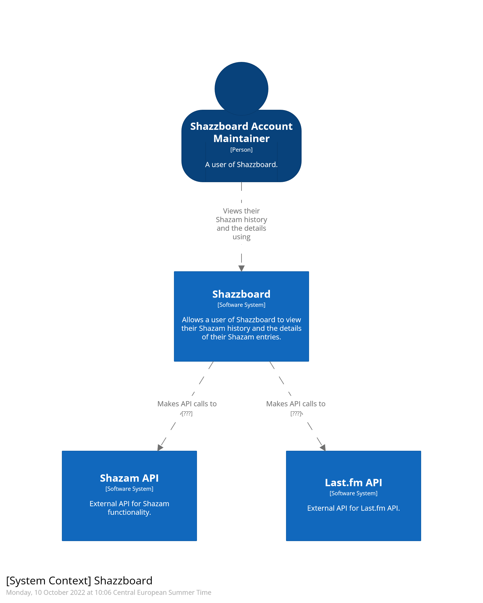
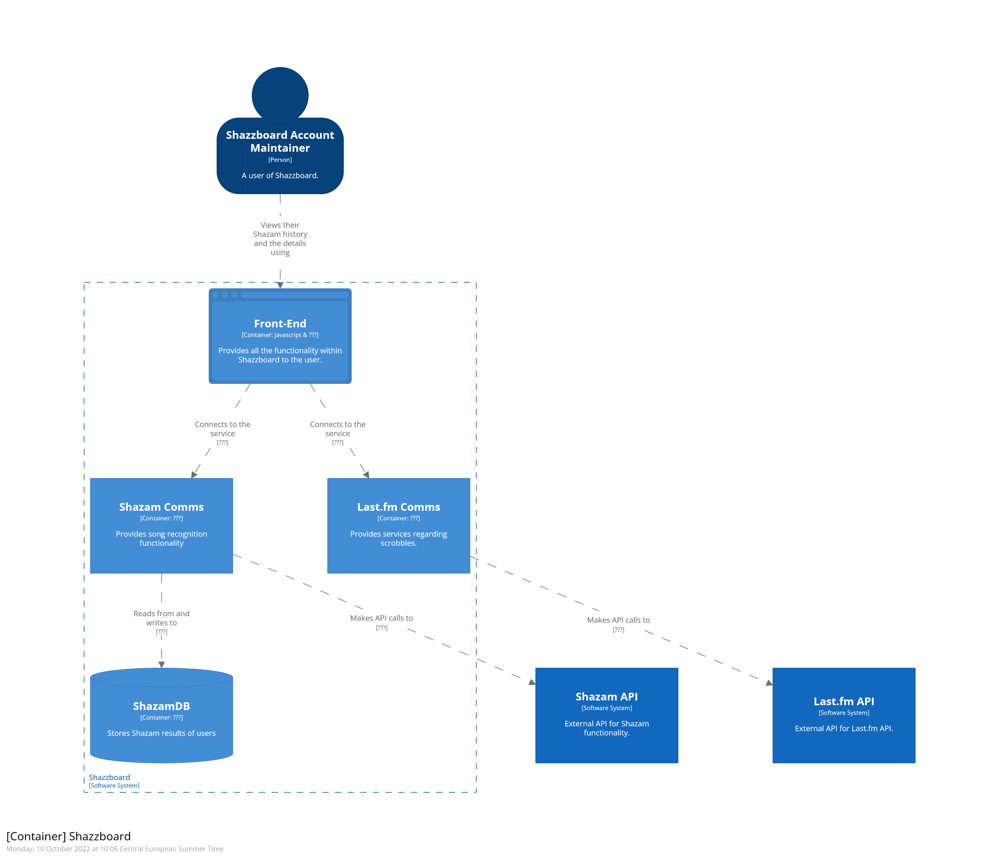

# User stories & C4-model

The main project I'l be working on during semester 3 is a dashboard with shazam and lastfm itegrations. To get a rough idea what functionalities the project needs, I've defined user stories and sketched a C4-model for the application.

## User stories
### Preface
The definition of a user here is someone who:
- Makes use of the Shazam app.
- Enjoys music.
- Is familiar with using a web application and PC's or smartphones. 

### User stories
- As a user, I want to see my Shazam history within the dashboard.
	- The first page that will be displayed after registering or logging in must show the registered user's Shazam history.
	- General song information (e.g. song name and artist name) must be displayed for every result in the history page.
- As a user, I want to see the band details of the Shazam result I have selected.
	- The artist name with the artist description must be displayed on the dashboard when an artist is selected.
- As a user, I want to scrobble my results to Last.fm when I desire.
	- The dashboard must have an option for the user to scrobble their Shazam result to Last.fm.

* 05 September 2022. Subject to change.*

## C4-model
### Context

*14 September 2022. Subject to change.*

### Container

*14 September 2022. Subject to change.*